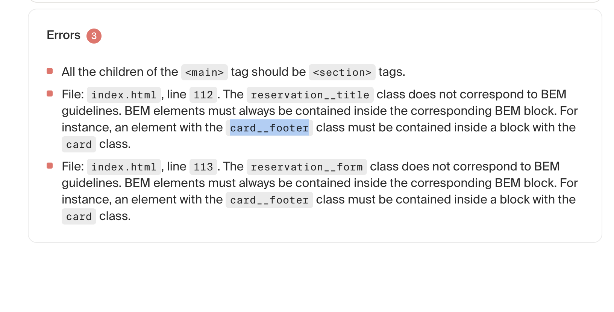

# 2nd Project: Coffee in the Triple Peaks Library

This is the second project of the Software Engineering program at TripleTen. It was created using HTML and CSS, based on the design brief.

## Project features

- Semantic HTML5
- Flexbox
- Positioning
- Flat BEM file structure
- A custom form
- CSS animation and transform

## Notes

- I followed the briefs as best I could and whenever I was stuck on something I would watch the Youtube videos and made changes from there.

- Recent updates include BEM refactoring, finishing my Landing Page, and the README file.

## Errors

- When it was time to submit the codes I had 3 errors and was able to take a screenshot of it. I was so confused and read the first line and checked my </section> tag and put it at the bottom of the page and submitted the code again and it went through.

## Experience on working on Sprint 2

- In this sprint I was tasked with creating a Landing Page about a coffee shop aka a study zone.

- I was introduced to Git for the very first time as well as GitHub. It was a surprise to learn about Git and at the same time using it in VS Code.

- Spending time working on the stages 1-4 of the project was very exciting, stressful, and challenging. It was fun using index.html and styling the code. I had no idea that CSS was this useful and was surprised to read somewhere that on this project it was used as a workaround because I had not yet learned JS.

## Description of the project

- This Landing Page allows users a fun way study! The coffee shop has a barista that serves hot/cold drinks and baked goods!
- It is a great enviornment to work on your goals and interact with others as well as make new friends.

- Some of it's features include booking a table in advance, checking out it's recipes so you can replicate it at home and it functions as a easy way to meet some friends by making a reservation and having the recipes accessible to make at home.

## Technologies used in Booking a table

- On the home page I used the navigation bar to click on the Book a Table link so I can get there and make a reservation for this upcoming friday.

- While making my reservation I forgot to add Date & Time and encountered an error telling me to finish filling out the field.

-After filling out everything i was successful in submitting the reservation.

## Technologies used in Recipes

- There is a section on the Landing Page were there are Youtube videos in which there a recipes a user can watch to replicate at home.

- You can see that I interacted the video and it is being played on this image.

## Technologies used in About the coffee shop & Footer

- On the last page of the Landing Page there are social media icons that can be clicked but doesn't take you anywhere and on the top left corner of the screen there is a cool animation of a circle as well!

## Plans for improving the project

- I plan on improving the project through seeing what the human checker found.

-Things such as errors that are gray (suggestions)
-Things that are errors in red (ones I really improve on)

- I would like to implement better html structuring and styling. I like prettier and other tools and would like to grow using more tools such as those.

- Another improvement is adding useful features such as potentially games and more animations.

- More ideas are bound to come hopefully as I learn more about VS Code, Git, GitHub, and other features.
